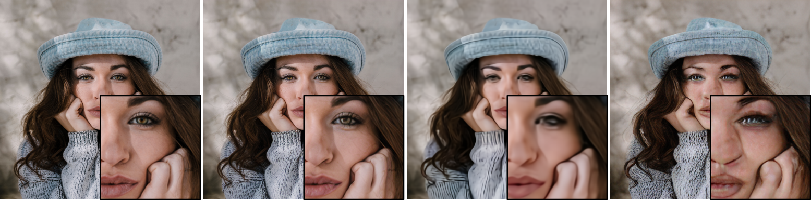

<<<<<<< HEAD
# Latent Diffusion for Scalable Generation of Electron Microscopy Image-Mask Pairs
CS771-project
=======
# Latent Diffusion Models
[arXiv](https://arxiv.org/abs/2112.10752) | [BibTeX](#bibtex)

<p align="center">

</p>


To get started, install the additionally required python packages into your `ldm` environment
```shell script
pip install transformers==4.19.2 scann kornia==0.6.4 torchmetrics==0.6.0
pip install git+https://github.com/arogozhnikov/einops.git
```

## Data preparation
python data_augmentation.py


## Model Training

python main.py


## Pretrained Autoencoding Models


All models were trained until convergence (no further substantial improvement in rFID).

| Model                   | rFID vs val | train steps           |PSNR           | PSIM          | Link                                                                                                                                                  | Comments              
|-------------------------|------------|----------------|----------------|---------------|-------------------------------------------------------------------------------------------------------------------------------------------------------|-----------------------|
| f=4, VQ (Z=8192, d=3)   | 0.58       | 533066 | 27.43  +/- 4.26 | 0.53 +/- 0.21 |     https://ommer-lab.com/files/latent-diffusion/vq-f4.zip                   |  |
| f=4, VQ (Z=8192, d=3)   | 1.06       | 658131 | 25.21 +/-  4.17 | 0.72 +/- 0.26 | https://heibox.uni-heidelberg.de/f/9c6681f64bb94338a069/?dl=1  | no attention          |
| f=8, VQ (Z=16384, d=4)  | 1.14       | 971043 | 23.07 +/- 3.99 | 1.17 +/- 0.36 |       https://ommer-lab.com/files/latent-diffusion/vq-f8.zip                     |                       |
| f=8, VQ (Z=256, d=4)    | 1.49       | 1608649 | 22.35 +/- 3.81 | 1.26 +/- 0.37 |   https://ommer-lab.com/files/latent-diffusion/vq-f8-n256.zip |  
| f=16, VQ (Z=16384, d=8) | 5.15       | 1101166 | 20.83 +/- 3.61 | 1.73 +/- 0.43 |             https://heibox.uni-heidelberg.de/f/0e42b04e2e904890a9b6/?dl=1                        |                       |
|                         |            |  |                |               |                                                                                                                                                    |                       |
| f=4, KL                 | 0.27       | 176991 | 27.53 +/- 4.54 | 0.55 +/- 0.24 |     https://ommer-lab.com/files/latent-diffusion/kl-f4.zip                                   |                       |
| f=8, KL                 | 0.90       | 246803 | 24.19 +/- 4.19 | 1.02 +/- 0.35 |             https://ommer-lab.com/files/latent-diffusion/kl-f8.zip                            |                       |
| f=16, KL     (d=16)     | 0.87       | 442998 | 24.08 +/- 4.22 | 1.07 +/- 0.36 |      https://ommer-lab.com/files/latent-diffusion/kl-f16.zip                                  |                       |
 | f=32, KL     (d=64)     | 2.04       | 406763 | 22.27 +/- 3.93 | 1.41 +/- 0.40 |             https://ommer-lab.com/files/latent-diffusion/kl-f32.zip                            |                       |


```


>>>>>>> b2c2c6e (LDM commit)
